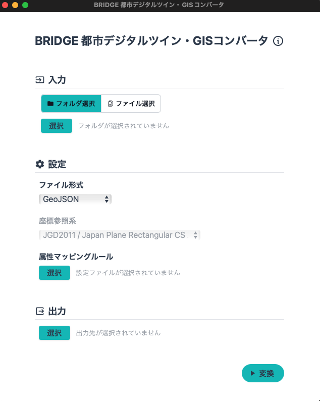
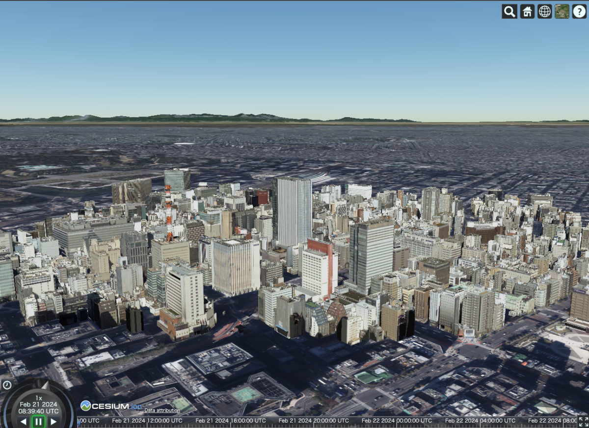

# GISコンバータ (PLATEAU GIS Converter)

[](https://github.com/MIERUNE/nusamai/actions/workflows/test_app.yml)
[](https://github.com/MIERUNE/nusamai/actions/workflows/test_libs.yml)
[](https://codecov.io/gh/MIERUNE/PLATEAU-GIS-Converter)
<!--
[](https://mierune.github.io/nusamai/app/)
-->

## 1. 概要

PLATEAU GIS Converter は、[PLATEAU](https://www.mlit.go.jp/plateau/)プロジェクトのCityGML形式の3D都市モデルを他の一般的なGISデータ形式に変換するソフトウェアです。

アプリケーションのメイン画面:



[東京都23区の CityGML (v2)](https://www.geospatial.jp/ckan/dataset/plateau-tokyo23ku-2022/resource/55c72dd0-32eb-4107-9526-71fc0af8d50f3) を読み込んで、3DTilesに変換した例：



## 2. 「GISコンバータ」について

PLATEAUの標準仕様に準拠したCityGML2.0形式の3D都市モデルは、専門のGISツールやCUIツールを用いて他のGIS形式に変換して用いられることが一般的ですが、一般ユーザーが簡易に利用可能な汎用的ツールは存在しません。
このため、流通や活用の範囲が専門家や技術者に限られていました。
「GISコンバータ」を利用することで、3D都市モデルを用いた様々な分析・開発を行うことができます。

- GeoPackage 形式による QGIS 等での解析
- Mapbox Vector Tiles (MVT) 形式による、大規模データのWeb等での高速描画
- KML 形式による Google Earth での可視化
- 3D Tiles 形式による Cesium 等での可視化
- など

## 3. 利用手順

- ソフトウェアの最新版は[Releaseページ](https://github.com/MIERUNE/PLATEAU-GIS-Converter/releases)からダウンロードしてください。
- 詳しい利用方法については、こちらの[マニュアル](https://MIERUNE.github.io/PLATEAU-GIS-Converter/index.html)をご覧ください。

## 4. システム概要

本ソフトウェアの機能は以下の通りです。

- 3D都市モデル（CityGML）の変換
  - 3D Tiles
  - Mapbox Vector Tiles (MVT)
  - GeoPackage
  - GeoJSON
  - Shapefile
  - KML
  - CZML
- データの一括変換
- 属性マッピングルールの取り込み
- 特定の座標系へ座標変換して出力

## 5. 利用技術

利用技術は以下の通りです。

### UI

UIの構築には以下の技術を利用しています。

- ネイティブアプリケーション構築フレームワーク: [Tauri](https://github.com/tauri-apps/tauri)
- UI構築フレームワーク: [Svelte](https://svelte.dev/)

### メインロジック

メインロジックは全てRustで実装しています。

- プログラミング言語: [Rust](https://www.rust-lang.org/)

## 6. 動作環境

- 本ソフトウェアは以下の環境で動作することを想定しています。
- OS:
  - Windows（Intel）
  - macOS（Apple Silicon）
- CPU:
  - 特に制限はありませんが、変換対象の範囲や出力形式によっては処理時間に大きな影響があります
- メモリ:
  - 特に制限はありませんが、変換対象が広い場合、変換時には多くのメモリが必要になります
- ネットワーク:
  - インターネット接続は不要です
- ストレージ:
  - インストールには30MB程度の空き容量が必要です
  - 変換時には、変換元データとほぼ同等、もしくはそれ以上の空き容量が必要です

## 7. 本リポジトリのフォルダ構成

- アプリケーション：
  - [`app`](./app/) &mdash; Tauri による GUI 実装
  - [`nusamai`](./nusamai/) &mdash; バックエンドおよびコマンドライン版の実装
- 基盤・ユーティリティ：
  - [`nusamai-geometry`](./nusamai-geometry/) &mdash; ジオメトリ型
  - [`nusamai-projection`](./nusamai-projection/) &mdash; 投影法変換
- データソース：
  - [`nusamai-citygml`](./nusamai-plateau/citygml/) &mdash; CityGML パーサ実装支援ライブラリ
    - [`macros`](./nusamai-plateau/citygml/macros/) &mdash; パーサ導出用の proc macros
  - [`nusamai-plateau`](./nusamai-plateau/) &mdash; PLATEAU 用の CityGML モデルおよびパーサ
- 変換先形式のための支援ライブラリ（本プロジェクトのユースケースと癒着しないように構成する）
  - [`nusamai-3dtiles`](./nusamai-3dtiles/) &mdash; 3D Tiles
  - [`nusamai-mvt`](./nusamai-mvt/) &mdash; Mapbox Vector Tiles (MVT)
  - [`nusamai-gpkg`](./nusamai-gpkg/) &mdash; GeoPackage
  - [`nusamai-gltf`](./nusamai-gltf/) &mdash; glTF
  - [`nusamai-geojson`](./nusamai-geojson/) &mdash; GeoJSON
  - [`nusamai-kml`](./nusamai-kml/) &mdash; KML
  - [`nusamai-czml`](./nusamai-kml/) &mdash; CZML
  - [`nusamai-shapefile`](./nusamai-shapefile/) &mdash; Shapefile

## 8. ライセンス

- 本リポジトリはMITライセンスで提供されています。
- 本ソフトウェアの開発は[株式会社MIERUNE](https://www.mierune.co.jp/)が行っています。
- ソースコードおよび関連ドキュメントの著作権は国土交通省に帰属します。

## 9. 注意事項

- 本リポジトリおよびソフトウェアは Project PLATEAU の参考資料として提供しているものです。動作の保証は行っておりません。
- 本リポジトリの内容は予告なく変更・削除する場合があります。
- 本リポジトリおよび本▽ソフトウェアの利用により生じた損失及び損害等について、国土交通省および開発者はいかなる責任も負わないものとします。

## 10. 参考資料

- [PLATEAU プロジェクト](https://www.mlit.go.jp/plateau/)
- [3D都市モデル標準製品仕様書](https://www.mlit.go.jp/plateaudocument/)

## Development (開発者向け情報)

### 外部リポジトリ

- [MIERUNE/earcut-rs](https://github.com/MIERUNE/earcut-rs) &mdash; ポリゴン三角形化アルゴリズム
- [MIERUNE/japan-geoid](https://github.com/MIERUNE/japan-geoid) &mdash; 日本のジオイドモデル (JGD2011 → WGS 84 の変換)

### その他参考リポジトリ

- [MIERUNE/plateau-qgis-plugin](https://github.com/MIERUNE/plateau-qgis-plugin) &mdash; PLATEAU QGIS Plugin の実装

<!--
- [MIERUNE/plateau-schema-experiment](https://github.com/MIERUNE/plateau-schema-experiment) &mdash; CityGML 2.0 と i-UR の XML Schema を解析する実験コード群。QGIS Pluginの属性列挙に使用。
- [MIERUNE/3dtiles-research](https://github.com/MIERUNE/3dtiles-research) &mdash; 3D Tiles / glTF の実験コード群
-->

### Build &amp; Run

#### CLI

```bash
cd ./nusamai/
# Debug (非常に低速)
cargo run -- ~/path/to/PLATEAU/15100_niigata-shi_2022_citygml_1_op/udx/bldg/*.gml --sink geojson --output foobar.geojson
# Release (最適化コンパイル、実用速度)
cargo run --release -- ~/path/to/PLATEAU/15100_niigata-shi_2022_citygml_1_op/udx/bldg/*.gml --sink geojson --output foobar.geojson
# Release (LTO有効のプロダクションビルド、最高速)
cargo run --profile release-lto -- ~/path/to/PLATEAU/15100_niigata-shi_2022_citygml_1_op/udx/bldg/*.gml --sink geojson --output foobar.geojson
```

#### GUI

Dev:

```bash
cd ./app/
npm install
RUST_BACKTRACE=1 npx tauri dev
```

Build:

```bash
cd ./app
npx tauri build
```

### Test

#### Coverage

Codecov: <https://app.codecov.io/gh/MIERUNE/nusamai>

```bash
cargo llvm-cov --workspace --exclude app --html --all-features
```
