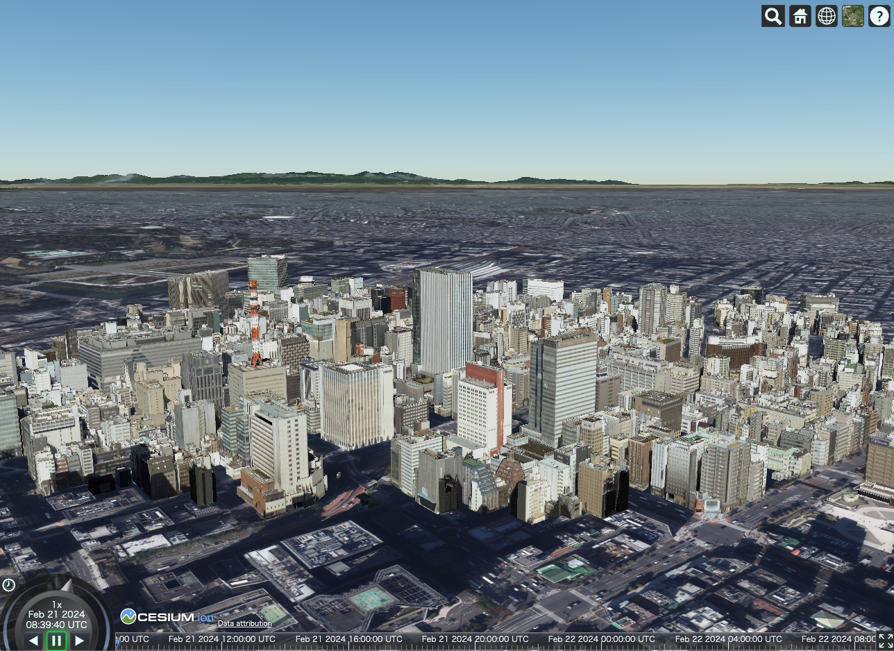

# PLATEAU 都市デジタルツイン・GISコンバータ（PLATEAU GIS Converter）

PLATEAU GIS ConverterはCityGML形式の3D都市モデルを標準的なGISデータに変換するオーサリングツールです。本ツールでは3D都市モデルを以下の形式に変換することが可能です。

- GeoJSON
- Shapefile
- GeoPackage
- 3DTiles
- KML
- CZML
- Mapbox Vector Tiles

PLATEAU-GIS-Converterを利用することで、3D都市モデルを用いた様々な分析・開発を行うことが可能です。

- GeoPackageによるQGIS等での解析
- Mapbox Vector Tilesを用いた大規模データの高速描画
- 3DTilesを利用したCesiumでの可視化
- など
