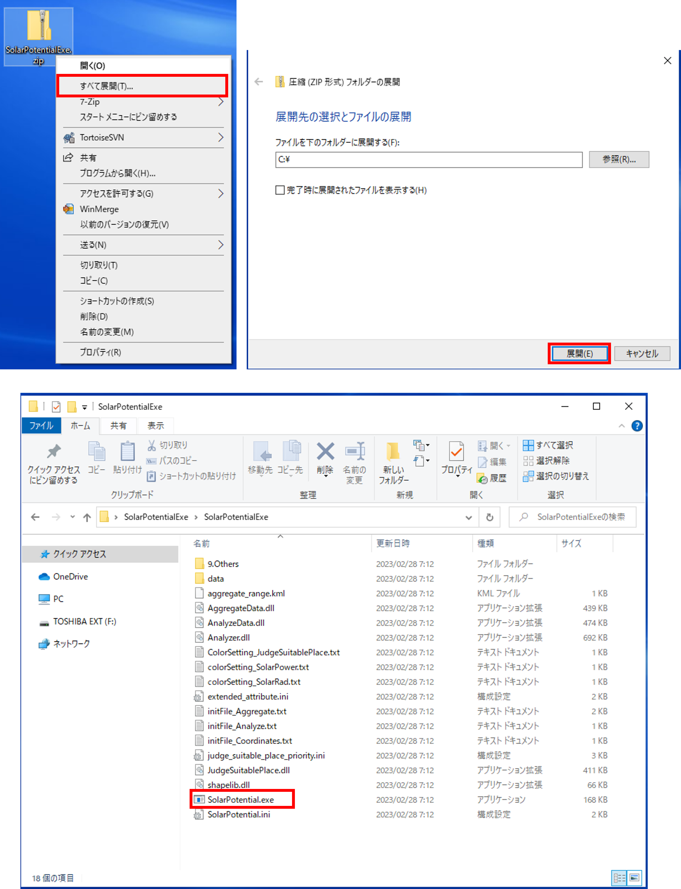
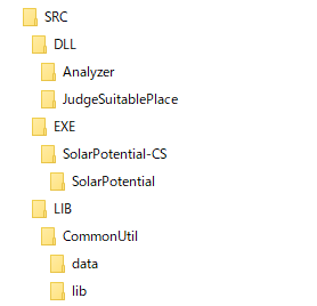
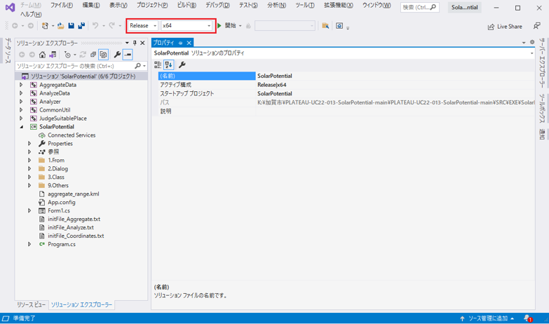
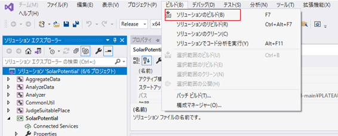
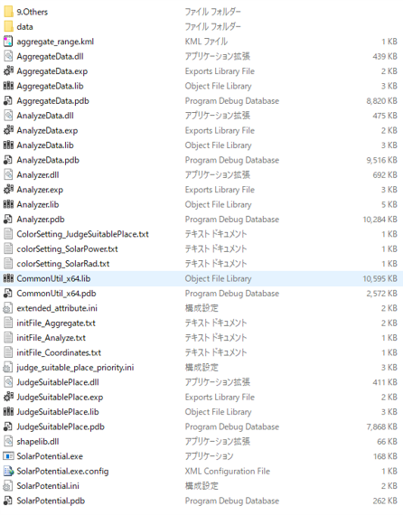
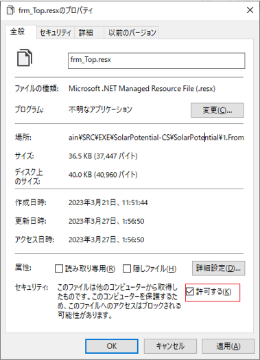
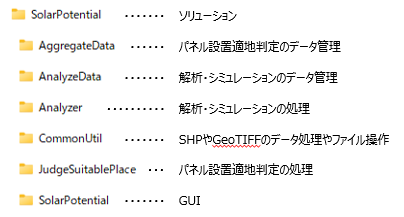

# 環境構築手順書

# 1 本書について

本書では、カーボンニュートラル施策推進支援システム（以下「本システム」という。）の利用環境構築手順について記載しています。本システムの構成や仕様の詳細については以下も参考にしてください。

[技術検証レポート](https://www.mlit.go.jp/plateau/file/libraries/doc/plateau_tech_doc_0030_ver01.pdf)

# 2 動作環境

本システムの動作環境は以下のとおりです。

| 項目 | 最小動作環境 | 推奨動作環境 | 
| - | - | - | 
| OS | Microsoft Windows 10 または 11 | 同左 | 
| CPU | Intel Core i3以上 | Intel Core i5以上 | 
| メモリ | 4GB以上 | 8GB以上 | 
| ディスプレイ解像度 | 1024×768以上 |  同左  | 
| ネットワーク       | 【解析・シミュレーション】 不要  【集計・適地判定】 範囲選択機能を使用しない場合はネットワーク環境は不要 範囲選択機能を使用する場合、以下のURLを閲覧できる環境が必要 ・地理院地図（国土地理院）　 http://cyberjapandata.gsi.go.jp ・地図表示のため標準地図 https://cyberjapandata.gsi.go.jp/xyz/std/{z}/{x}/{y}.png |  同左                            | 

# 3 インストール手順

[こちら](https://github.com/Project-PLATEAU/UC22-013-SolarPotential/releases/)
からアプリケーションをダウンロードします。

ダウンロード後、zipファイルを右クリックし、「すべて展開」を選択することで、zipファイルを展開します。

展開されたフォルダ内の「SolarPotential.exe」をダブルクリックすることで、アプリケーションが起動します。

# 4 ビルド手順

自身でソースファイルをダウンロードしビルドを行うことで、実行ファイルを生成することができます。\
ソースファイルは
[こちら](https://github.com/Project-PLATEAU/UC22-013-SolarPotential/)
からダウンロード可能です。

GitHubからダウンロードしたソースファイルの構成は以下のようになっています。

（1）本システムのソリューションファイル（SolarPotential.sln）をVisualStudio2019で開きます。

ソリューションファイルはSRC\\EXE\\SolarPotential-CS\\SolarPotentialに格納されています。

（2）SolarPotential.slnをVisualStudio2019で開くと、ソリューション'SolarPotential'に6つのプロジェクトが表示されます。

以下の赤枠部分のように、ソリューション構成を【Release】に、ソリューションプラットフォームを【x64】に設定します。

（3）以下の赤枠部分のように、\[ソリューションのビルド\]を選択し、ソリューション全体をビルドします。

（4）ビルドが正常に終了すると、ソリューションファイルと同じフォルダにあるbin\\Releaseフォルダに実行ファイルが生成されます。

※ダウンロードしたソリューションをビルドする際に、ビルドエラーとなり、次のメッセージが出力されるケースがあります。

「（ファイル名）を処理できませんでした。インターネットまたは制限付きゾーン内にあるか、ファイルに
Web のマークがあるためです。これらのファイルを処理するには、Web
のマークを削除してください。」

この場合は該当するファイルのプロパティを開き、全般タブ内の「セキュリティ」の項目について\[許可する\]にチェックを入れてください。

【参考】

ソースファイルの構成と機能は以下のようになっています。コードを修正する際の参考としてください。

# 5 準備物一覧

アプリケーションを利用するために以下のデータを入手します。

| | データ種別 | 機能                                                                                                                        | 用途                 | 入力方法           |
| ---------- | --------------------------------------------------------------------------------------------------------------------------- | -------------------- | ------------------ | ------------------------------------------------ |
| ①          | 3D都市モデル(CityGML)G空間情報センターから取得します。  https://front.geospatial.jp/                                         | 全般                 | 全般               | 格納フォルダパス指定                             |
| ②          | 月毎の可照時間国立天文台 こよみの計算Webページから取得します。  https://eco.mtk.nao.ac.jp/cgi-bin/koyomi/koyomix.cgi         | 発電ポテンシャル推計 | 日射量の推計       | CSVファイルを手動作成しファイルパス指定          |
| ③          | 毎月の平均日照時間気象庁 過去の気象データ・ダウンロードから取得します。  https://www.data.jma.go.jp/gmd/risk/obsdl/index.php | 発電ポテンシャル推計 | 日射量の推計       | CSVファイルをダウンロードしファイルパス指定      |
| ④          | 月毎の積雪深NEDO 日射量データベース閲覧システム METPV-20から取得します。  https://appww2.infoc.nedo.go.jp/appww/index.html   | 発電ポテンシャル推計 | 日射量の推計       | CSVファイルを手動作成しファイルパス指定          |
| ⑤          | 3D都市モデル(DEMデータ)G空間情報センターから取得します。  https://front.geospatial.jp/                                       | 発電ポテンシャル推計 | 日射量の推計       | 格納フォルダパス指定                             |
| ⑥          | 制限区域データ（シェープファイル） （加賀市　景観整備区域・石川県　石川県眺望計画）                                                                                          | パネル設置適地判定   | パネル設置適地判定 | シェープファイルパス指定                         |
| ⑦          | 気象関連データ（積雪）(国土数値情報の平年値（気候）メッシュ)| パネル設置適地判定   | パネル設置適地判定 | シェープファイルをダウンロードしファイルパス指定 |

本システムでは、3D都市モデルの建築物モデルの形状（LOD1、LOD2）と属性を活用します。

地形を考慮した解析を行う場合は、地形（LOD1）も活用してください。

| 地物       | 地物型            | 属性区分 | 属性名                                 | 内容                 |
| ---------- | ----------------- | -------- | -------------------------------------- | -------------------- |
| 建築物LOD2 | bldg:Building     | 空間属性 | bldg:RoofSurface                       | 建築物のLOD2の屋根面 |
|            |                   |          | bldg:WallSurface                       | 建築物のLOD2の壁面   |
|            |                   | 主題属性 | bldg:measuredHeight                    | 計測高さ             |
|            |                   |          | uro:buildingDisasterRiskAttribute      | 災害リスク           |
|            |                   |          | uro:buildingID                         | 建物ID               |
|            |                   |          | uro:buildingStructureType              | 構造種別             |
|            |                   |          | uro:buildingStructureOrgType           | 構造種別（独自）     |
|            |                   |          | uro:BuildingRiverFloodingRiskAttribute | 洪水浸水リスク       |
|            |                   |          | uro:depth                              | 浸水深               |
|            |                   |          | uro:BuildingTsunamiRiskAttribute       | 津波浸水リスク       |
|            |                   |          | uro:depth                              | 浸水深               |
|            |                   |          | uro:BuildingLandSlideRiskAttribute     | 土砂災害リスク       |
| 建築物LOD1 | bldg:Building     | 空間属性 | bldg:lod1Solid                         | 建築物のLOD1の立体   |
| 地形LOD1   | dem:ReliefFeature | 空間属性 | dem:tin                                | 地形LOD1の面         |