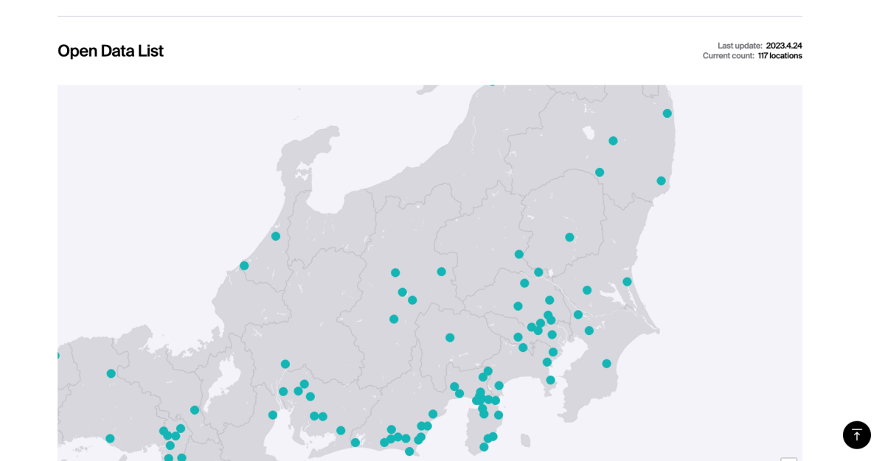
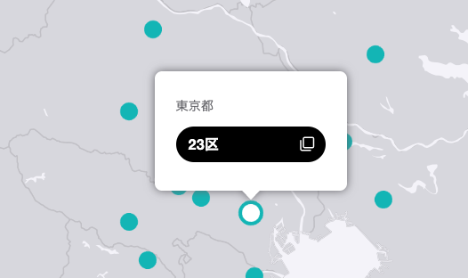
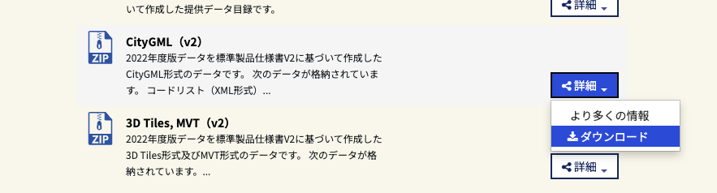
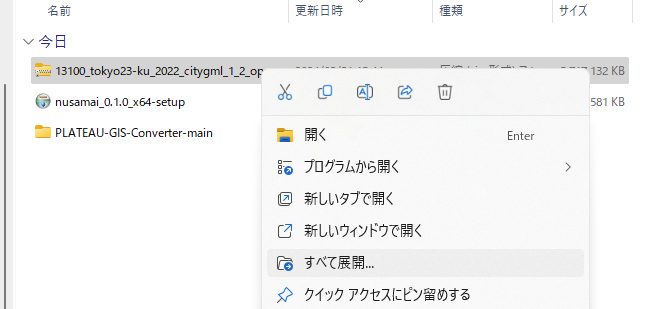

# 3D都市モデル（CityGML）をダウンロードする

## ダウンロード

3D都市モデル（CityGML）は、以下のURLからダウンロードできます。
<https://www.mlit.go.jp/plateau/open-data/>

必要な地域の点をクリックしてください。

G空間情報センターより「CityGML（v2）」または「CityGML（v3）」を選択しましょう。
東京23区など、人口の多い地域は比較的データが多く、ダウンロードに時間がかかることがあります。
また、ダウンロードしたファイルはzip圧縮された状態でも5GBを超えることがあり、解凍するとさらに大きくなります。
ストレージの空き容量に注意してください。

ダウンロードしたファイルは、解凍してください。

これでデータのダウンロードは完了です。
他の地域のデータが必要な場合は、同じ手順でダウンロードしてください。
