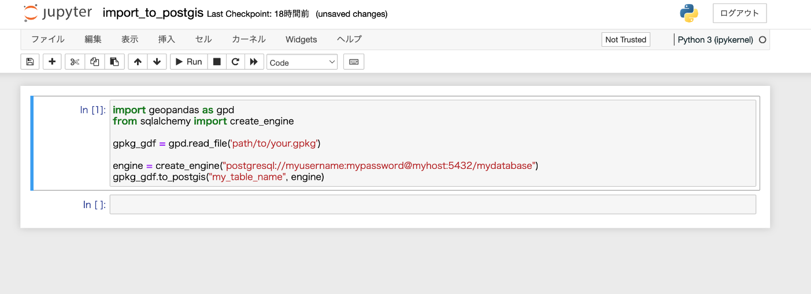
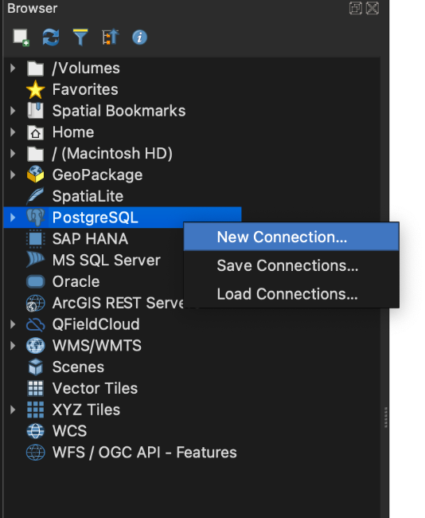
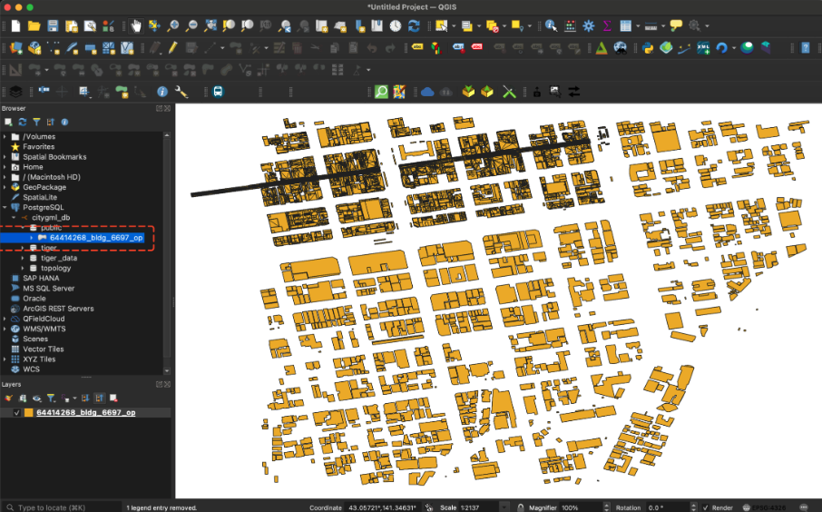

# PostGISにインポートする

- 本ページでは、GeoPackageファイルをPostGISにインポートする手順を説明します。
- インポート手順は以下の通りです。
  1. GeoPackageに変換する
  2. GeoPandas(Python)で取り込む
  3. QGISで表示する
- 本ページの手順ではDockerおよびjupyter notebookを利用しています。
- jupyter notebookやjupyter labは、Docker以外にもAnacondaやpipを利用して環境を構築することができます。自身の環境に合わせて構築してください。
- Docker自体は、以下のリンクからインストールすることができます。
  - [Install Docker Engine](https://docs.docker.com/engine/install/)

## GeoPackageに変換する

コマンドラインまたはGUIを利用してGeoPackageへの変換手順は以下のマニュアルを参考にします。

- [GUIで利用する](./use_gui.md)
- [コマンドラインで利用する](./use_command_line.md)

## GeoPandas(Python)で取り込む

- 実行環境
  - Python3.9
  - 依存するパッケージ
    - geopandas (Version 0.14.3)
    - psycopg2-binary (Version 2.9.9)
    - geoalchemy2 (0.14.4)

- 以下のDocker環境を利用してJupyter Notebook環境を構築することができます。

```bash
cd demo/postgis
docker compose up
```

Dockerコンテナを起動し、コンソールに表示されるToken付きのローカルホストURLにアクセスすると、ブラウザでJupyter Notebookが立ち上がります。

URL例：
`http://127.0.0.1:8888/lab?token=******`

- 取り込む処理の実行
  `import_to_postgis.ipynb`を開き、データベース情報と投入するGeoPackageファイルの情報を書き換え、実行することによって、データベースにデータを読み込むことができます。



## QGISで表示する

- データベースへ接続します
  QGISのブラウザにある「PostgreSQL」項目を右クリック→New Connectionをクリックします。データベース情報を入力し、データベースに接続します。



- 読み込まれたテーブル名をダブルクリックし、QGISに表示されます。


