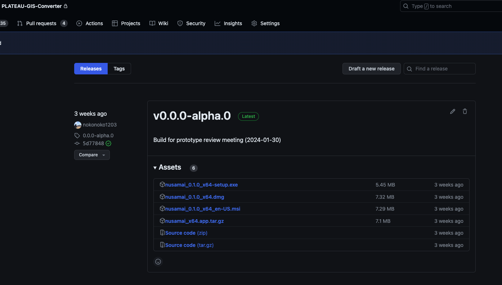

# インストール

## ダウンロード

GitHubリポジトリの[リリースページ](https://github.com/MIERUNE/PLATEAU-GIS-Converter/releases)からダウンロードすることが可能です。

windowsを利用している方は、`nusamai_<最新バージョン>_x64-setup.exe`をダウンロードしてください。
MacOSを利用している方は、`nusamai_<最新バージョン>_x64.dmg`をダウンロードしてください。

## windowsでのインストール

ダウンロードした`nusamai_<最新バージョン>_x64-setup.exe`を実行します。

## MacOSでのインストール
