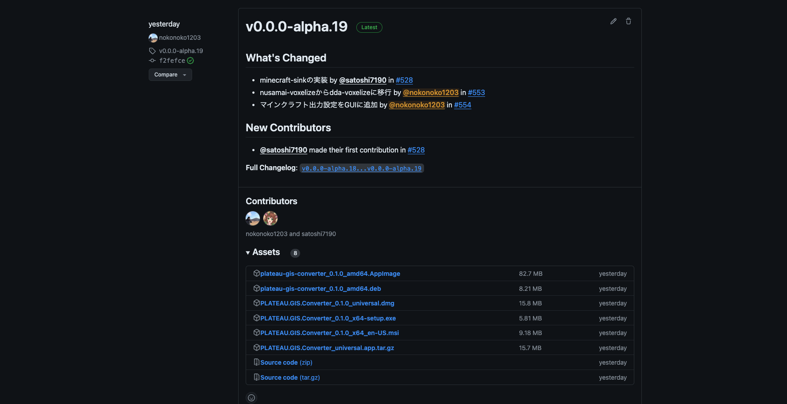
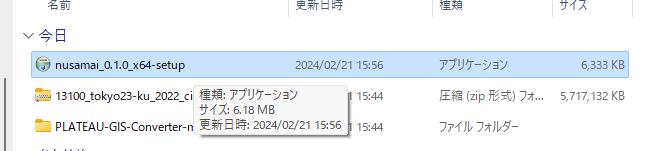
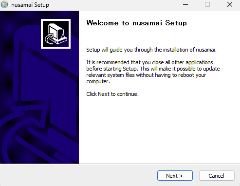
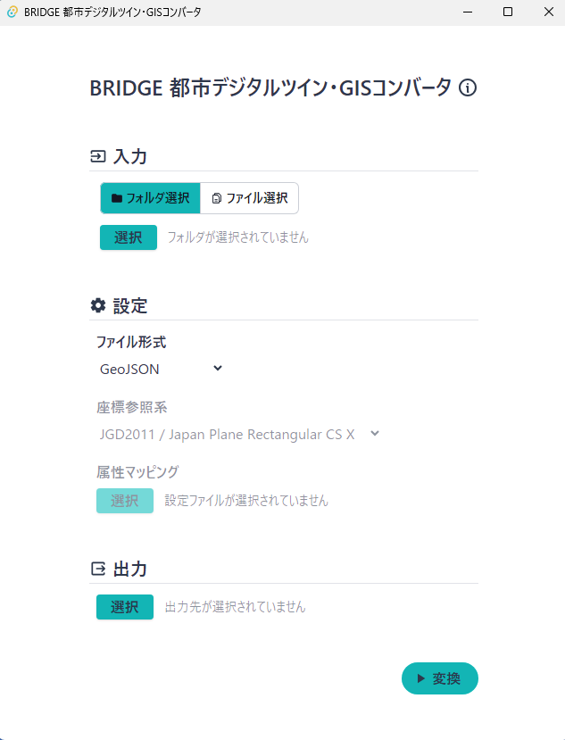
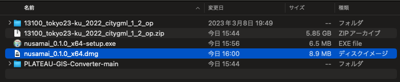
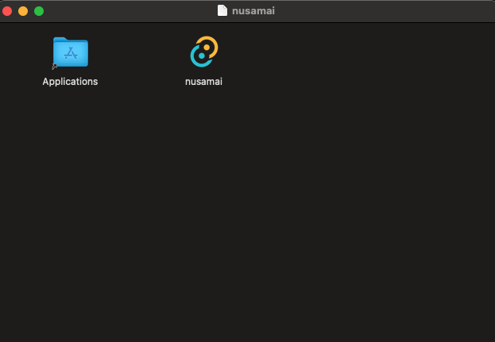
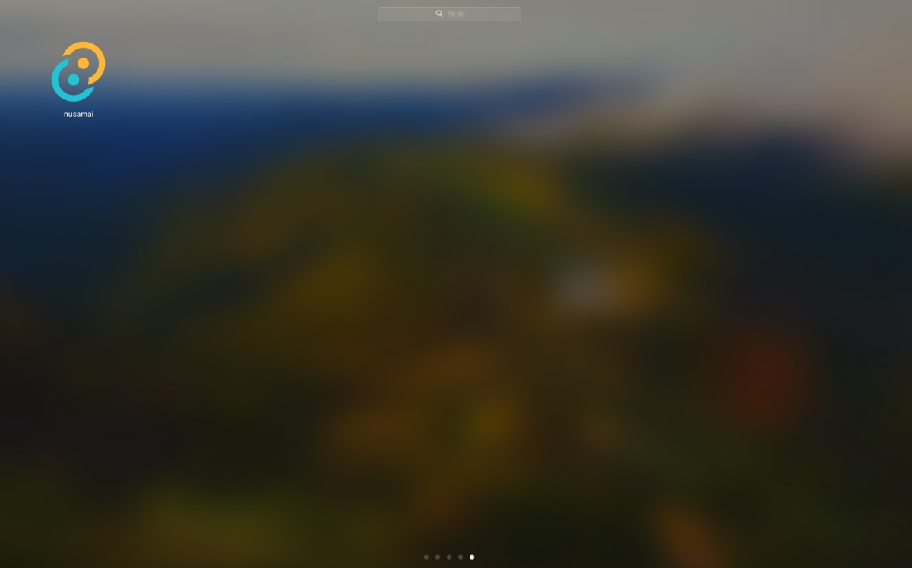
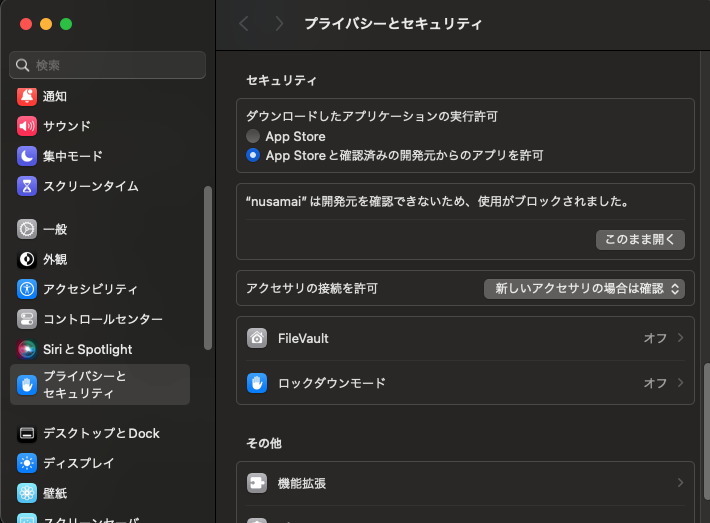
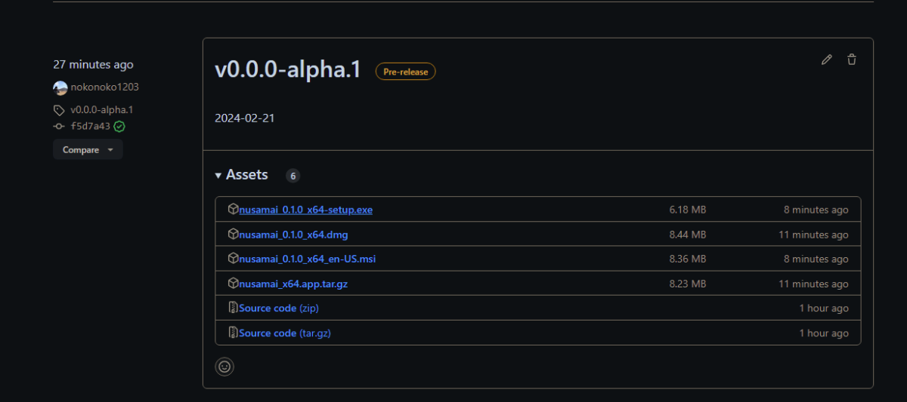

# インストール

## ダウンロード

GitHubリポジトリの[リリースページ](https://github.com/MIERUNE/PLATEAU-GIS-Converter/releases)からダウンロードすることが可能です。

windowsを利用している方は、`PLATEAU.GIS.Converter_<最新バージョン>_x64-setup.exe`をダウンロードしてください。
macOSを利用している方は、`PLATEAU.GIS.Converter_<最新バージョン>_universal.dmg`をダウンロードしてください。

## windowsでのインストール

ダウンロードした`PLATEAU.GIS.Converter_<最新バージョン>_x64-setup.exe`を実行します。

インストールウィザードが表示されるので、指示に従ってインストールを行ってください。

インストールが完了すると、アプリケーションが起動します。

## macOSでのインストール

ダウンロードした`PLATEAU.GIS.Converter_<最新バージョン>_universal.dmg`を実行します。

アプリケーションをアプリケーションフォルダーに移動します。

メニューにアプリケーションが追加されていることを確認します。

以下のような警告が表示される場合がありますので、`プライバシーとセキュリティ`から「このまま開く」をクリックしてください

「開く」をクリックすると、アプリケーションが起動します。

