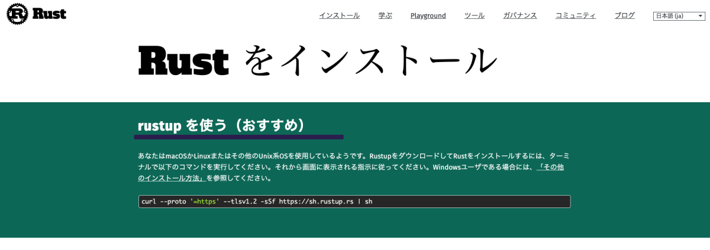
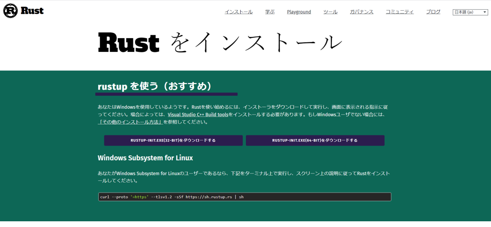
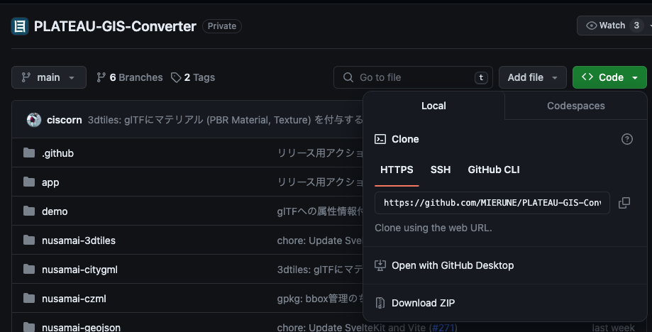

# コマンドラインで利用する

本アプリはコマンドラインから利用することも可能です。

## Rustのインストール

[公式サイト](https://www.rust-lang.org/ja/tools/install)に従い、Rustをインストールしてください。macOSかLinuxの場合は、以下のコマンドでインストールできます。

```sh
curl --proto '=https' --tlsv1.2 -sSf https://sh.rustup.rs | sh
```



Windowsの場合は、[公式サイト](https://www.rust-lang.org/ja/tools/install)からインストーラをダウンロードしてください。



## リポジトリをクローンする

本ツールのソースコードをクローンしてください。
GitHubでの開発に慣れている方は、コマンドラインでcloneしても良いですし、そうではない方は、`Download ZIP`ボタンをクリックしてダウンロードしてください。



ZIPファイルでダウンロードした方は、解凍した後に、コマンドラインで解凍したディレクトリに移動してください。
たとえば、`~/Downloads/PLATEAU-GIS-Converter-main`に解凍した場合は、以下のコマンドで移動できます。

```sh
cd ~/Downloads/PLATEAU-GIS-Converter-main
```

## データを変換する

以下のようにコマンドを実行することで、GeoPackageに変換できます。
実行速度が高速になればなるほど、コンパイルに時間がかかります。

```bash
cd ./nusamai/

# Debug (非常に低速)
cargo run -- ~/path/to/PLATEAU/15100_niigata-shi_2022_citygml_1_op/udx/bldg/*.gml --sink geojson --output foobar.geojson

# Release (最適化コンパイル、実用速度)
cargo run --release -- ~/path/to/PLATEAU/15100_niigata-shi_2022_citygml_1_op/udx/bldg/*.gml --sink geojson --output foobar.geojson

# Release (LTO有効のプロダクションビルド、最高速)
cargo run --profile release-lto -- ~/path/to/PLATEAU/15100_niigata-shi_2022_citygml_1_op/udx/bldg/*.gml --sink geojson --output foobar.geojson
```

### 設定項目

- `--` : 以降の引数はファイル名として解釈されます。`*`を使って複数ファイルを指定できます。
- `--sink` : 出力形式を指定します。以下のように指定することが可能です。
  - `3dtiles` : 3D Tiles
  - `gpkg` : GeoPackage
  - `mvt` : Mapbox Vector Tiles
  - `geojson` : GeoJSON
  - `czml` : CZML
  - `gltf` : glTF
  - `kml` : KML
  - `ply` : PLY
  - `minecraft` : Minecraft Java World Data
  - `obj`: Wavefront OBJ
  - `shapefile` : Shapefile
- `--output` : 出力先を指定します。拡張子なども指定してください。
- `-t`: 利用するLODを指定可能です。利用可能なオプションはGUIと同様です。
  - `use_lod`
    - `max_lod`: 最大LODを抽出する
    - `min_lod`: 最小LODを抽出する
    - `textured_max_lod`: テクスチャ付きの最大LODを抽出し、テクスチャがない場合は最大のLODを抽出する
- `-o`: 出力ファイル形式固有のオプションを設定します。
  - `split`: OBJ形式専用です。オブジェクト分割についてbool値で設定します。
  - `limit_texture_resolution`: 3D形式専用です。距離（メートル）あたりのテクスチャ解像度を制限します。
    - 有効にすると、小さな地物の過剰に高解像度なテクスチャを適切に調整し、全体的なパフォーマンスを向上させます。

#### 設定例

- 中央区すべての建築物を、テクスチャ付きで3D Tilesに変換する

```bash
cargo run --release -- ~/13102_chuo-ku_city_2023_citygml_1_op/udx/bldg/*.gml \
--sink 3dtiles --output ~/data/output/3dtiles_textured -t use_lod=textured_max_lod
```

- テクスチャ付きかつ、テクスチャ解像度を制限してOBJ形式を出力する

```bash
% cargo run --release -- ~/13104_shinjuku-ku_city_2023_citygml_1_op/udx/bldg/53394525_bldg_6697_op.gml \
--sink obj --output ~/data/output/obj -t use_lod=textured_max_lod -o limit_texture_resolution=true -o split=true
```
