# 操作マニュアル

# 1 本書について

本書では、カーボンニュートラル施策推進支援システム（以下「本システム」という。）の操作手順について記載しています。

# 2 使い方

## 2-1 トップ画面

本システムの実行ファイル「SolarPotential.exe」を実行すると以下の画面が表示されます。

① 解析・シミュレーション

発電ポテンシャル推計や反射シミュレーション等の解析処理を行う画面へ移動します。

② 集計・適地判定

解析結果の集計やパネル設置の適地判定を行う画面へ移動します。

③ 終了

アプリケーションを終了します。

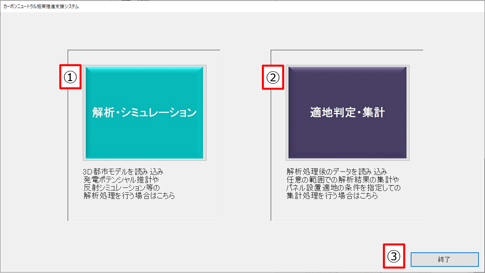

## 2-2 解析・シミュレーション画面

① 解析処理入力データ選択

・「選択」ボタンを押下するとファイル/フォルダ選択のダイアログが表示され、ダイアログの中で選択したパスがテキストボックスに入力されます。

② パラメータ入力

・手入力が必要な設定項目について、テキストボックス、コンボボックス等で設定します。

③ 解析・シミュレーション開始

・①入力データ選択及び②パラメータ入力を行ったうえで「解析・シミュレーション開始」ボタンを押下すると、解析開始確認のダイアログが表示された後に解析処理が行われます。

④ トップ画面

・解析・シミュレーション画面を閉じ、トップ画面に戻ります。

⑤ パラメータの保存・復元

・入力内容を保存し、繰り返し解析を行う場合にその保存内容を読み込むことで設定の手間を減らします。

⑥ 処理単位の設定

・「日射量・発電量推計のみ実行」又は「反射シミュレーションのみ実行」にチェックを入れると、チェックを入れた内容のみが実行され、処理時間を短縮することができます。
いずれにもチェックを入れない場合はすべての解析・シミュレーションが実行されます。

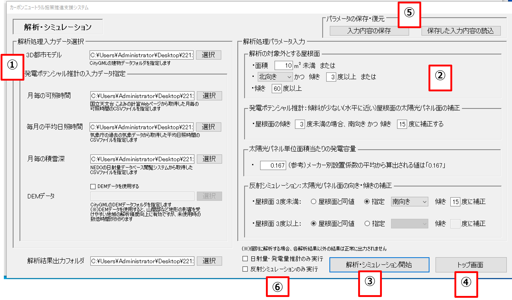

## 2-2-1 入力データ選択

本システムでは以下のサンプルデータの利用が可能です。

| | データ名 | 出典                 |
| -------- | -------------------- | ----------------------------------------------------------- |
| ①        | 3D都市モデル         | CityGML                                                     |
| ②        | 月ごとの可照時間     | 国立天文台（こよみの計算Webページ）                         |
| ③        | 月ごとの平均日照時間 | 気象庁（過去の気象データ・ダウンロード）                    |
| ④        | 月ごとの積雪深       | NEDO（国立研究開発法人 新エネルギー・産業技術総合開発機構） |

① 3D都市モデル

・CityGML形式の建物データが格納されたフォルダを指定します。

② 月ごとの可照時間

・国立天文台のウェブサイト（こよみの計算Webページ）から取得した月ごとの可照時間のCSVファイルを指定します。

③ 毎ごとの平均日照時間

・気象庁のウェブサイト（過去の気象データ・ダウンロード）から取得した平均日照時間のCSVファイルを指定します。

④ 月ごとの積雪深

・NEDO（国立研究開発法人
新エネルギー・産業技術総合開発機構）のウェブサイト（日射量データベース閲覧システム）から取得したCSVファイルを指定します。

⑤ DEMデータ【オプション機能】

・CityGML形式のDEMデータが格納されたフォルダを指定します。

・処理に時間がかかり、メモリも多く使用するためオプション機能としています。

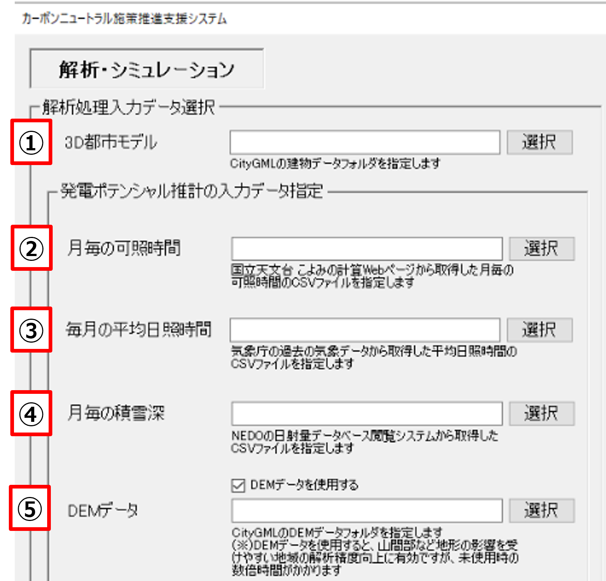

## 2-2-2 パラメータ入力

① 解析の対象外とする屋根面

・対象外とする屋根面の設定を行います。

・解析の対象外とする方位をプルダウンから選択するとともに、解析の対象外とする面積と傾きの基準値をテキストボックスに入力します。

②
発電ポテンシャル推計：傾斜が少ない（水平に近い）屋根面の太陽光パネル面の補正

・指定した傾き未満の屋根面について、南向き、かつ、指定した傾きに補正します。

・補正の対象となる屋根面の傾きと補正後の傾きをテキストボックスに入力します。

③ 太陽光パネルの単位面積当たりの発電容量

・年間予測発電量を推計する前提となる太陽光パネルの単位面積当たりの発電容量を設定します。

・太陽光パネルの単位面積当たりの発電容量をテキストボックスに入力します。

④ 反射シミュレーション：太陽光パネル面の方位・傾きの補正

・指定した傾き未満又は指定した傾き以上の屋根面について、向き・傾きを補正します。

・「屋根面と同値」か「指定」をラジオボタンで選択します。

・「指定」を選択した場合、補正する方位をプルダウンから選択するとともに、補正後の傾きをテキストボックスに入力します。

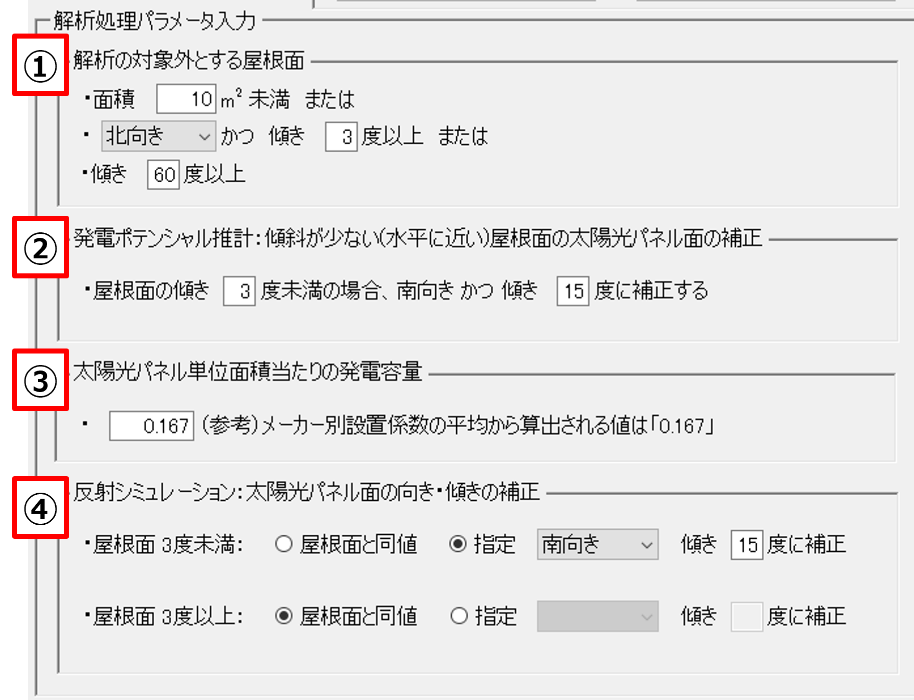

## 2-3 集計・適地判定画面

① 解析結果フォルダ

・解析・シミュレーション結果を出力した解析結果フォルダ（「解析_YYYYMMDDhhmm」のフォルダ）を指定します。

② 集計方法選択

・解析・シミュレーション結果の集計方法を選択します。

・「集計範囲を選択」を選択した場合、地図上で任意の範囲を矩形で選択できます。

・範囲を選択すると選択範囲の座標が選択範囲パネルのテキストボックスに自動で入力されます。

③ 適地判定条件設定

・チェックボックスにチェックを入れた項目が集計処理の条件となります。

・子項目に当たる入力欄やチェック項目は、親項目にチェックが入っている場合にのみ入力可能な状態となります。

④ 集計結果出力フォルダ

・「選択」ボタンを押下するとフォルダ選択のダイアログが開きます。

・集計結果が出力されるフォルダを選択します。

⑤ 判定・集計開始

・選択した集計方法及び設定した適地判定条件に従い、集計を開始します。

⑥ トップ画面

・集計・適地判定画面を閉じてトップ画面に戻ります。

⑦ 判定条件の保存・復元

・入力内容を保存し、繰り返し解析を行う場合に、その保存内容を読み込むことで設定の手間を減らします。

※初期表示

・画面表示時は各ボタンは入力可能な状態

・適地判定条件設定において全てチェックが入っていない状態であり、子項目に当たるものは入力できない状態

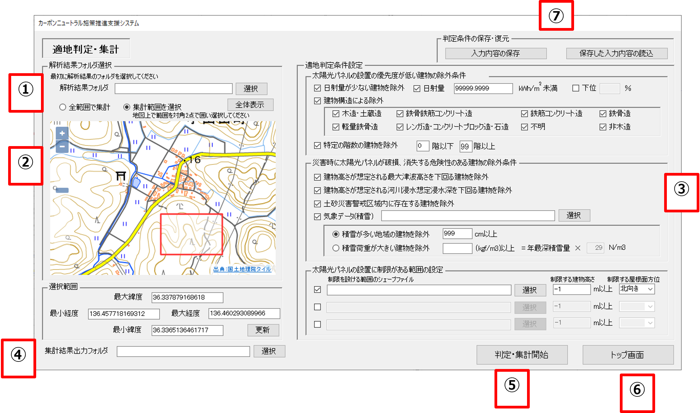

## 2-3-1 適地判定条件設定

① 太陽光パネルを設置する優先度が低い建物の除外条件

② 災害時に太陽光パネルが破損し、又は消失する危険性のある建物の除外条件

③ 太陽光パネルの設置に制限がある範囲の設定

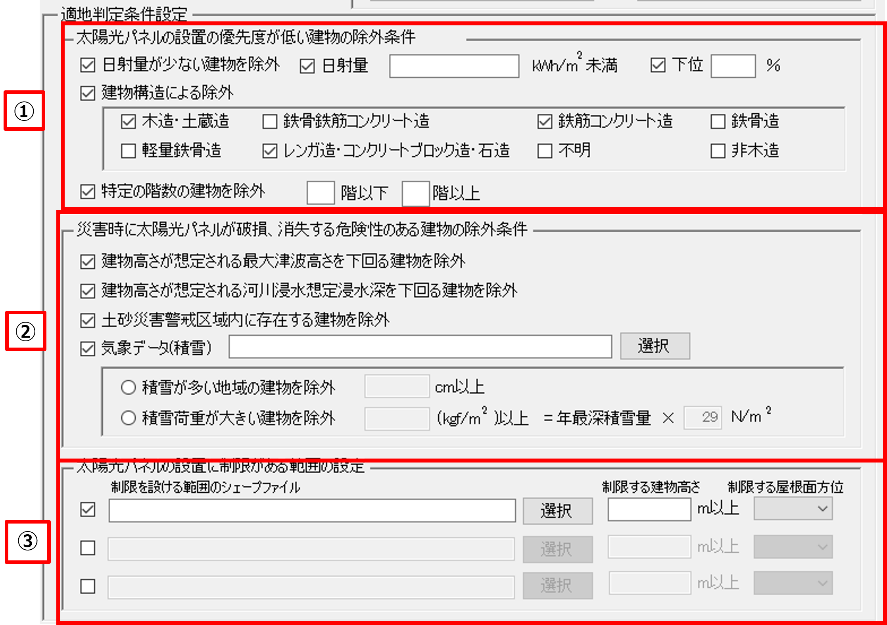

## 2-3-2 適地判定条件設定：太陽光パネルの設置の優先度が低い建物の除外条件

① 日射量が少ない建物を除外

・日射量が少ない建物を除外するか否かを選択します。

・「日射量が少ない建物を除外」にチェックを入れた場合、「日射量」と「下位」が入力可能な状態になります。

② 日射量による建物除外の設定

・日射量の推計結果を用いて、指定した日射量未満の建物を除外します。

・日射量で建物を除外する場合、「日射量」にチェックを入れ、線引きを行う日射量をテキストボックスに入力します。

③ 割合による建物除外の設定

・日射量の推計結果を用いて、指定した割合で建物を除外します。

・日射量の割合で建物を除外する場合、「下位」にチェックを入れ、線引きを行う割合をテキストボックスに入力します。

④ 建物構造による除外

・建物構造による除外をするか否かを選択します。

・構造上、太陽光パネルの設置が困難な可能性がある建物を、CityGMLの構造種別の属性を用いて除外することができます。

⑤ 建物構造の選択

・④の「建物構造による除外」にチェックを入れた場合、建物の構造種別が選択可能になるため、除外する建物構造にチェックを入れます。

⑥ 特定の階数の建物を除外

・特定の階数の建物を除外するか否かを選択します。

・指定した階数範囲の建物を、CityGMLの建物地上階数の属性を用いて除外します。

・「特定の階数の建物を除外」にチェックを入れた場合、階数を指定するテキストボックスが入力可能な状態になるため、テキストボックスに除外する建物階数を入力します。

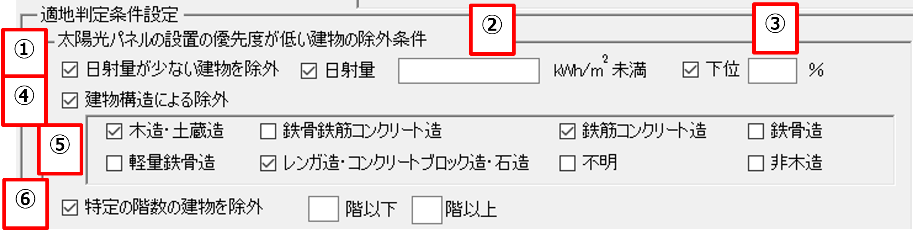

## 2-3-3 適地判定条件設定：災害時に太陽光パネルが破損、消失する危険性のある建物の除外条件

① 最大津波高さを下回る建物を除外

・チェックを入れた場合、津波浸水区域のランクと建物高さを用いて建物を除外します。

② 河川浸水想定浸水深を下回る建物を除外

・チェックを入れた場合、河川浸水想定の浸水深と建物高さを用いて建物を除外します。

③ 土砂災害警戒区域内に存在する建物を除外

・チェックを入れた場合、土砂災害警戒区域内に存在する建物を除外します。

④ 気象データ(積雪)

・チェックを入れた場合、ファイル選択と⑤の項目が入力可能な状態になります。

・指定した条件に該当する建物を除外します。

・「選択」ボタンを押下して表示されたシェープファイル選択画面から積雪データのシェープファイルを選択するか、又はシェープファイルのパスをテキストボックスに入力します。

⑤ 積雪を考慮した除外建物の設定

・ラジオボタンで「積雪が多い地域の建物を除外」、又は「積雪荷重が大きい建物を除外」のいずれかの選択を行います。

・「積雪が多い地域の建物を除外」を選択した場合、線引きを行う積雪量をテキストボックスに入力します。

・「積雪荷重が大きい建物を除外」を選択した場合、線引きを行う積雪荷重又はと積雪の単位荷重をテキストボックスに入力します。

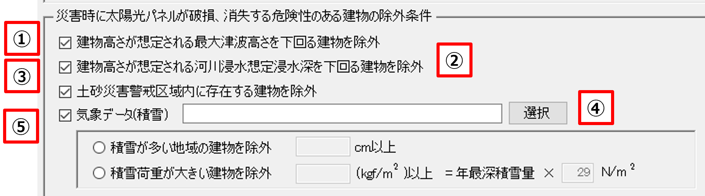

## 2-3-4 適地判定条件設定：太陽光パネルの設置に制限がある範囲の判定

① 有効/無効の設定

・区域制限を有効にする場合、①のチェックボックスにチェックを入れます。

・①のいずれかのチェックボックスにチェックを入れた場合、②～④の項目が入力可能な状態になります。

② シェープファイルの選択

・制限を設ける区域を設定します。

・「選択」ボタンを押下して表示されたシェープファイル選択画面から景観整備区域/眺望計画のシェープファイルを選択するか、又は景観整備区域/眺望計画のシェープファイルのパスをテキストボックスに入力します。

③ 制限する建物高さの指定

・制限する建物高さをテキストボックスに入力します。

・未入力とすることも可能です。その場合は建物高さによる制限は行わず、次の屋根面方位による制限のみを行います。

④ 制限する屋根面方位の指定

・プルダウンから制限する屋根面方位の指定を行います。

・方位指定なしとすることも可能です。その場合は屋根面方位による制限は行わず、建物高さによる制限のみを行います。

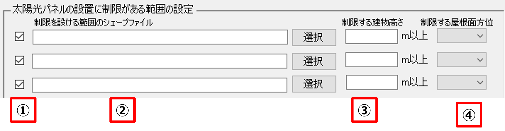

# 3 出力データ

解析・シミュレーション機能で出力されるデータは以下のとおりです。

  | 機能                 | 出力データ                               | 内容                                                                                                   | データ形式 |
| -------------------- | ---------------------------------------- | ------------------------------------------------------------------------------------------------------ | ---------- |
| 共通                 | CityGML                                  | 入力したCityGMLに年間予測日射量、年間予測発電量や光害発生時間等を属性として付与したデータ。            | CityGML    |
| 発電ポテンシャル推計 | 日照量のテクスチャ                       | CityGMLと合わせて読み込むことでPLATEAU　VIEWで屋根面ごとの単位面積あたりの年間日射量を表示します。     | JPG        |
|                      | 建物毎年間予測発電量                     | 建物ごとの年間予測日射量、年間予測発電量、パネル面積、単位面積あたりの年間予測発電量を記載したデータ。 | CSV        |
|                      | 単位面積あたりの年間予測日射量色分け画像 | 屋根面ごとの単位面積あたりの年間予測日射量で色分けした位置情報付き画像データ。                         | GeoTIFF    |
|                      | 単位面積あたりの年間予測発電量色分け画像 | 建物ごとの単位面積あたりの年間予測発電量で色分けした位置情報付き画像データ。                           | GeoTIFF    |
|                      | 単位面積あたりの年間日射量凡例           | 単位面積あたりの年間日射量の色分けの凡例画像データ。                                                   | JPG        |
|                      | 単位面積あたりの年間発電量凡例           | 単位面積あたりの年間発電量の色分けの凡例画像データ。                                                   | JPG        |
| 反射シミュレーション | 反射シミュレーション結果                 | 反射シミュレーションで解析した光線ベクトルの座標値を記載したデータ。                                   | CSV、CZML  |
|                      | 予測光害発生時間                         | 建物ごとの夏至、冬至、春分の光害発生時間を記載したデータ。                                             | CSV        |

集計・適地判定機能で出力されるデータは以下のとおりです。

| 機能               | 出力データ               | 内容                                                                                                                   | データ形式 |
| ------------------ | ------------------------ | ---------------------------------------------------------------------------------------------------------------------- | ---------- |
| パネル設置適地判定 | 適地判定結果データ       | 指定した条件で、建物ごとの優先度の判定結果を記載したデータ。                                                           | CSV        |
|                    | 適地判定色分け画像       | 建物ごとの優先度で色分けした位置情報付き画像データ。                                                                   | GeoTIFF    |
|                    | 集計結果データ           | 画面UI上で選択した範囲内の年間予測日射量・年間予測発電量・反射シミュレーション結果・予測光害発生時間を集計したデータ。 | CSV        |
|                    | 集計範囲の画像データ     | 適地判定・集計の画面UI上で選択した解析結果の集計範囲の地図画像データ。                                                 | JPG        |
|                    | 集計範囲のベクトルデータ | 適地判定・集計の画面UI上で選択した解析結果の集計範囲の矩形のベクトルデータ。                                           | KML        |

## 3-1 CityGML、日射量テクスチャ

本システムでは、発電ポテンシャル推計機能から算出された年間予測日射量と年間予測発電量、反射シミュレーション機能から算出された夏至、春分、冬至の予測公害発生時間の計5項目がLOD2の建築物モデルに属性として付与されます。

出力されるCityGMLは、LOD2の屋根面ごとに解析結果の日射量のテクスチャが割り当てられます。

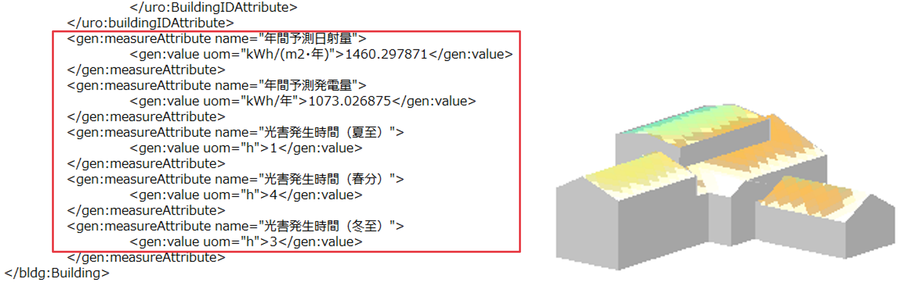

## 3-2 建物ごと年間予測発電量

発電ポテンシャル推計機能により算出された単位面積当たりの年間予測日射量、屋根面全体の年間予測発電量、単位面積当たりの年間予測発電量は、入力したCityGMLの3次メッシュID、建物IDに紐づいてCSV形式で出力されます。

あわせて、「屋根面メッシュ抽出」で抽出されたパネル面積及び建物中心の座標（X,Y）も出力されます。

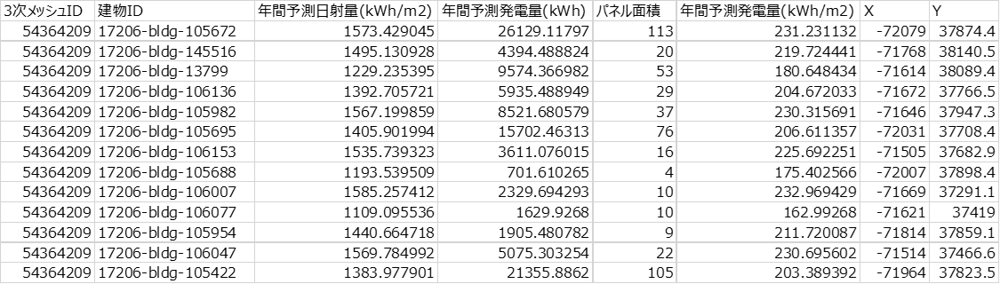

## 3-3 単位面積当たりの年間予測日射量による色分け画像量

発電ポテンシャル推計機能により算出された単位面積当たりの年間予測日射量は3次メッシュ単位でGeoTIFFで出力されます。

色の閾値は、外部ファイル「colorSetting_SolarRad.txt」から変更可能となっています。

画像ファイルに位置情報が付与されているため、GISソフト（QGISやArcGIS等）で利用可能です。

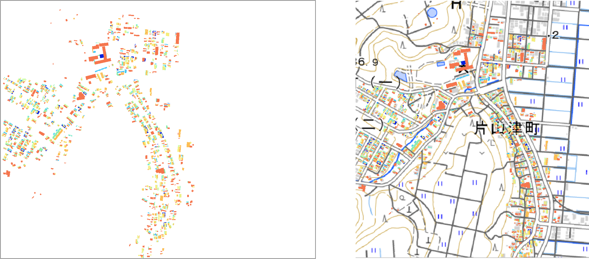

## 3-4 単位面積当たりの年間予測発電量による色分け画像

発電ポテンシャル推計機能により算出された単位面積当たりの年間予測発電量は3次メッシュ単位でGeoTIFFで出力されます。

色の閾値は、外部ファイル「colorSetting_SolarPower.txt」において変更が可能となっています。

画像ファイルに位置情報が付与されているため、GISソフト（QGISやArcGIS等）で利用可能です。

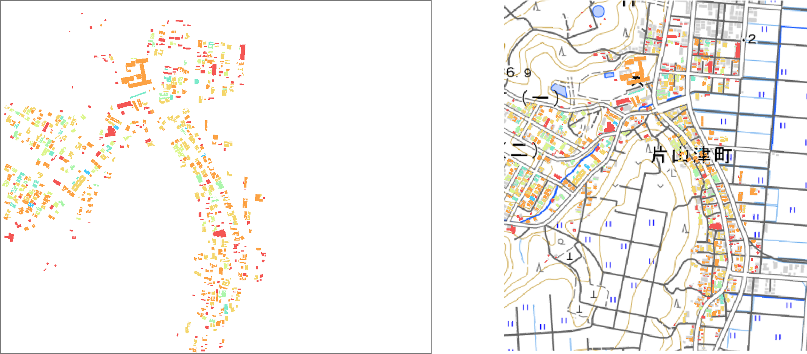

## 3-5 反射シミュレーション結果

反射シミュレーション機能のシミュレーション結果は、反射元の建物ID、反射元の屋根面ID、シミュレーション実施日時、反射点の座標（X,Y,Z）、反射先の座標（X,Y,Z）、反射先の建物IDが、夏至、春分、冬至の各時点についてCSVファイルに出力されます。

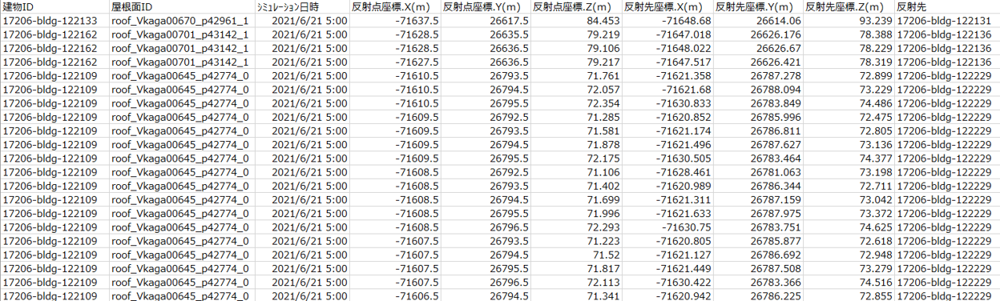

## 3-6 予測光害発生時間

反射シミュレーション機能により算出された予測光害発生時間は、入力したCityGMLの3次メッシュID、建物IDに紐づいて、夏至、春分、冬至の各時点について出力されます。

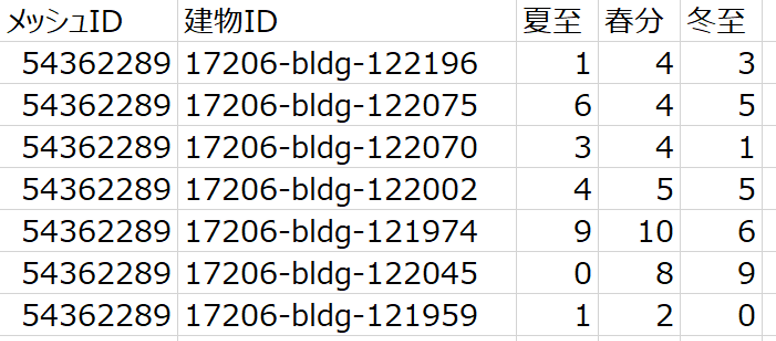

## 3-7 建物別適地判定結果データ

「適地判定・集計」機能では、建物別適地判定結果として、建物ごとの優先度と各判定条件の該当(○)非該当(×)判定外(－)がCSVファイルで出力されます。

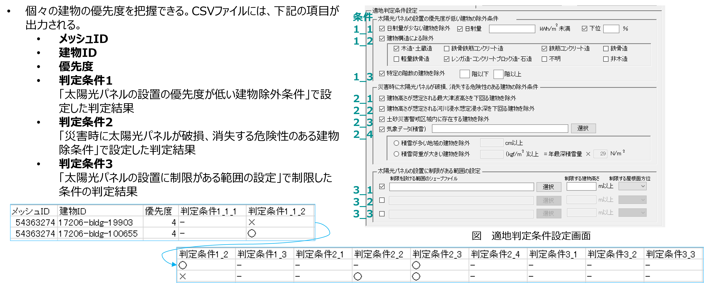

## 3-8 適地判定色分け画像

建物別適地判定結果は、優先度ごとに色分けされた画像がGeoTIFFで出力されます。

色の閾値は、外部ファイル「ColorSetting_JudgeSuitablePlace.txt」において変更が可能となっています。

画像ファイルに位置情報が付与されているため、GISソフト（QGISやArcGIS等）で利用可能です。

## 3-9 集計結果データ【CSV、JPG、KML】

「集計・適地判定」機能により算出された集計結果については、全範囲又は「集計画面の背景地図表示エリア」で選択した範囲内の結果がCSVファイルで出力されます。

CSVファイルには、範囲内建物数、年間予測日射量総計、年間予測発電量総計、光害を発生させる建物数、予測光害発生時間総計（夏至）、予測光害発生時間総計（春分）、予測光害発生時間総計（冬至）、範囲内優先度別建物数（優先度は5（高）～1（低）の5段階）が記載されます。

集計対象の範囲は、画像（JPG形式）とKMLで出力されます。

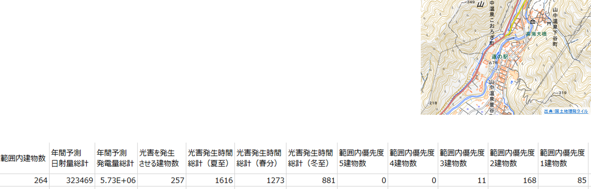

