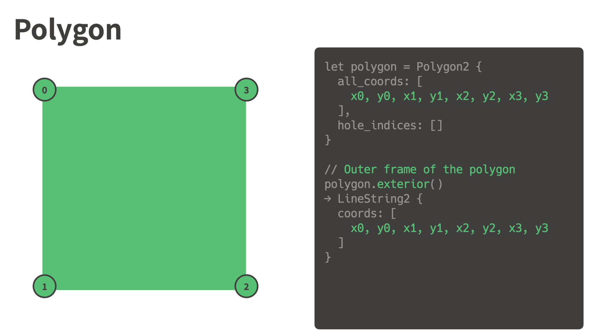
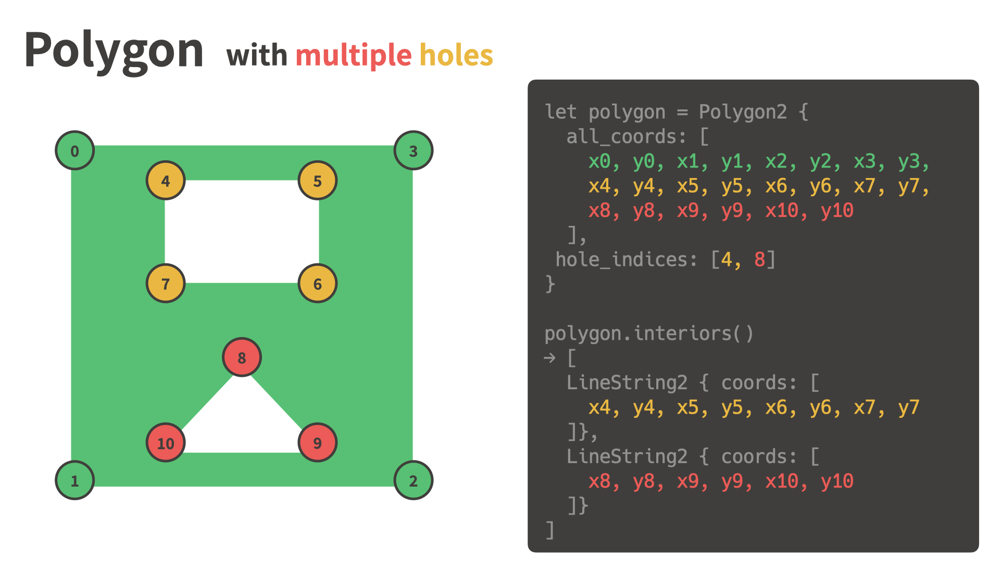

# nusamai-geometry

A compact representation of geometry data.

## Visual examples of the data structure

### LineString

### Polygon

### Polygon with a hole

### Polygon with multiple holes

### MultiPolygon

### MultiPolygon with holes

### Multiple polygons, multiple holes

