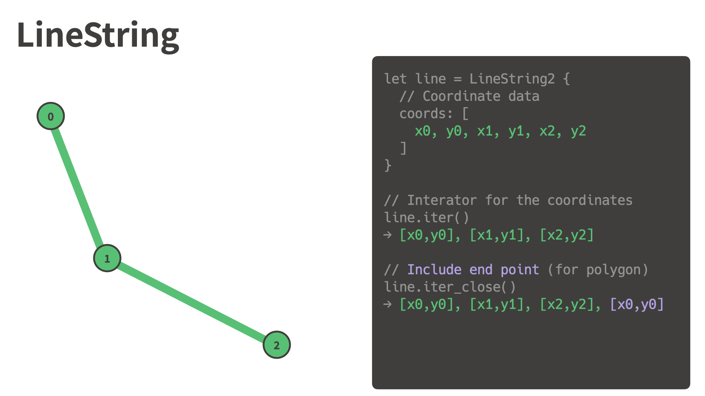
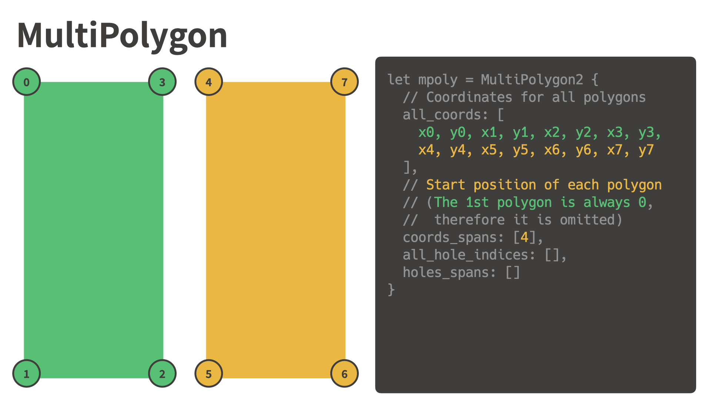
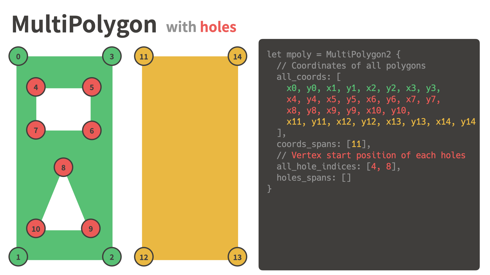

# nusamai-geometry

A compact, zero-copy geometry representation.

You can avoid using "Vector of Vector of Vector" to represent MultiPolygon.

## Visual examples of the data structure

### LineString

### Polygon

### Polygon with a hole

### Polygon with multiple holes

### MultiPolygon

### MultiPolygon with holes

### Multiple polygons, multiple holes

